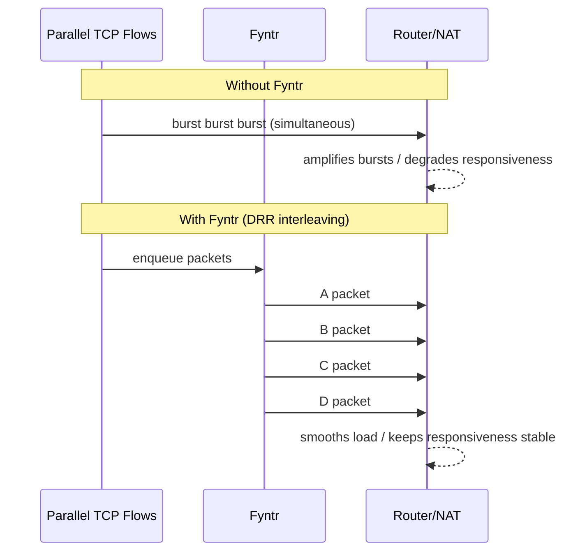

<div align="center">
  <p>
    <picture>
      <source media="(prefers-color-scheme: dark)" srcset="https://raw.githubusercontent.com/Crux-One/Fyntr/main/assets/fyntr.png">
      <source media="(prefers-color-scheme: light)" srcset="https://raw.githubusercontent.com/Crux-One/Fyntr/main/assets/fyntr.png">
        
    </picture>
  </p>

  <h1>
    Fyntr
  </h1>
  <p>
    A minimal forward proxy to tame bursty outbound traffic.

[](https://github.com/Crux-One/Fyntr)
[](https://github.com/Crux-One/Fyntr/releases/latest)
[](https://crates.io/crates/fyntr)

  </p>
</div>

## About
Fyntr *(/ˈfɪn.tər/)* is a minimal forward proxy for constrained networks that keeps them responsive under bursty outbound TLS traffic.
No server-side configuration, no inspection, and low baseline memory use.

## Internals
- Transparent CONNECT relay: Forwards TLS traffic E2E without termination or inspection.
- Traffic shaping: Interleaves packets across active flows using Deficit Round-Robin (DRR).
- Adaptive quantum tuning: Adjusts DRR quantum from observed packet-size statistics.
- FD limit guard: Checks file descriptor limits against max connection settings at startup.
- DoS guardrails: Caps request line/header sizes and per-flow queue buffering.

## Quick Start

1. Install and run Fyntr:

    Install the crates.io release and run it locally (defaults to port 9999).

    ```bash
    cargo install fyntr
    fyntr
    ```

    Or build from source:

    ```bash
    cargo run --release
    ```

    Override defaults via CLI flags or env vars:

    ```bash
    # CLI flags
    cargo run --release -- \
      --bind 127.0.0.1 \
      --port 8080 \
      --max-connections 512

    # Equivalent via environment variables
    FYNTR_BIND=127.0.0.1 \
    FYNTR_PORT=8080 \
    FYNTR_MAX_CONNECTIONS=512 \
    cargo run --release
    ```

    By default, Fyntr caps concurrent connections at 1000 (set `0` for unlimited).

2. Configure Your Environment:

    Export the following environment variables in a separate terminal.

    ```bash
    export HTTPS_PROXY=http://127.0.0.1:9999
    ```

    This configuration affects not only `aws-cli` but also various tools that use `libcurl`, including `git`, `brew`, `wget`, and more.

3. Verify It Works:

    You can test the connection with a simple `curl` command.

    ```bash
    curl https://ifconfig.me
    ```

## Library Usage

Requires [`actix-rt`][10] and [`anyhow`][11] in your application's dependencies. For logging, add [`env_logger`][12] (optional but recommended).

```rust
use fyntr::run;

#[actix_rt::main]
async fn main() -> anyhow::Result<()> {
    // Optional: enable logs via RUST_LOG (e.g., RUST_LOG=info) by adding:
    // env_logger::init();

    let handle = run::server()
        .bind("127.0.0.1")
        .port(0) // 0 lets the OS pick an available port
        .max_connections(512)
        .background()
        .await?;

    println!("Fyntr listening on {}", handle.listen_addr());

    // ... run your app ...

    handle.shutdown().await?;
    Ok(())
}
```

[10]:https://docs.rs/crate/actix-rt/latest
[11]:https://docs.rs/crate/anyhow/latest
[12]:https://docs.rs/crate/env_logger/latest

## CLI Options

### Server

| Option | Env var | Default | Description |
| --- | --- | --- | --- |
| `--bind <ADDR>` | `FYNTR_BIND` | `127.0.0.1` | Address/hostname to bind on (e.g. `127.0.0.1`, `::1`, `localhost`, `0.0.0.0`). Supports both IPv4 and IPv6. Binding to non-loopback interfaces without auth can expose the proxy on the network. |
| `--port <PORT>` | `FYNTR_PORT` | `9999` | Port to listen on (use `0` to auto-select an available port). |
| `--max-connections <MAX_CONNECTIONS>` | `FYNTR_MAX_CONNECTIONS` | `1000` | Maximum number of concurrent connections allowed (set `0` for unlimited). |

### CONNECT Policy

| Option | Env var | Default | Description |
| --- | --- | --- | --- |
| `--no-default-allow-port` | `FYNTR_NO_DEFAULT_ALLOW_PORT` | `false` | Disable implicit `443` allowance. Only explicitly configured `--allow-port` values are permitted. |
| `--allow-port <PORT>` | `FYNTR_ALLOW_PORT` | implicit `443` unless `--no-default-allow-port` | Allowed destination port for `CONNECT` in the range `1-65535` (repeat flag or comma-separate to add more). |
| `--deny-cidr <CIDR>` | `FYNTR_DENY_CIDR` | Internal ranges | CIDR ranges denied for `CONNECT` destination IPs (repeat flag or comma-separate). |
| `--allow-cidr <CIDR>` | `FYNTR_ALLOW_CIDR` | none | CIDR exceptions that are allowed even if they match denied internal ranges. |
| `--allow-domain <DOMAIN>` | `FYNTR_ALLOW_DOMAIN` | none | Domain/suffix allowlist for `CONNECT` targets. When a domain matches, addresses blocked by deny CIDRs are filtered out rather than causing the entire connection to fail. If all resolved addresses are blocked, the connection is denied. |

## Why Fyntr?
Cloud automation tools such as Terraform spawn bursts of TCP connections that rapidly open and close.

When many flows send data simultaneously, they can create short traffic spikes that overwhelm low-capacity routers, especially consumer NAT devices. This can cause CPU interrupts to be too high and make the network feel unresponsive.

Rather than relying on connection pooling, Fyntr regulates the traffic itself.



Its scheduler uses DRR to distribute sending opportunities across active flows fairly,
so packet bursts from many parallel flows get interleaved instead of letting them fire all at once.

This smoothing reduces CPU pressure on routers during connection storms.
This effect is most critical when scheduling overhead, rather than bandwidth, is the primary bottleneck.

## Limitations
1. In certain environments, DRR scheduling can reduce upload throughput, especially on low-spec hardware, as a trade-off for more stable responsiveness.
2. Currently, Fyntr supports only HTTP CONNECT tunneling (commonly used for HTTPS) and does not support plain HTTP proxying.
3. Fyntr has no built-in authentication. Exposing a public bind address can allow unauthorized proxy use.

## Usage with Terraform

### Example: AWS Provider

```bash
# Set environment variables
export HTTPS_PROXY=http://127.0.0.1:9999

# Standard usage
terraform apply

# Or use aws-vault wrapper
aws-vault exec my-profile -- terraform apply
```
